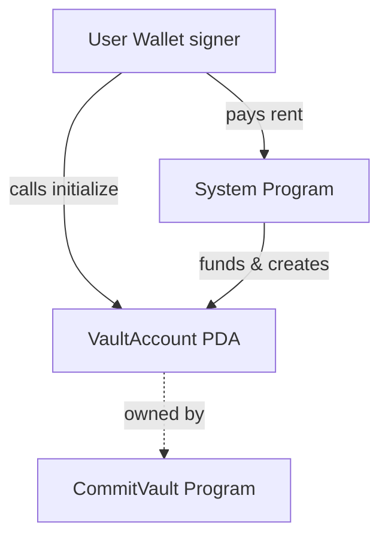

# 02 - Learning: VaultAccount Initialization

## What is the Initialize Instruction?

- The first on-chain action a user takes: creates their VaultAccount PDA.
- Sets up all fields needed for CommitVault logic.

## Account Flow

```txt
User Wallet ──┐
              ├─[initialize]──► VaultAccount (PDA, created & populated)
System Prog ─┘
```

### Vault Initialization Flow



## Anchor Macro Breakdown

- `#[account(init, payer = user, space = ...)]`: Tells Anchor to create this
  account on-chain, make the user pay for it, and reserve this much space for
  its data.
  NOTE: the `user` need to have comment with //CHECK xxxxx for safety check in Anchor
- `seeds = [b"vault", user.key().as_ref()]`: How Anchor derives the PDA (Program
  Derived Address). It combines the string "vault" and the user's public key to
  create a unique address for each user's vault.
- `bump`: A small number Anchor uses to make sure the address is valid. Think of
  it as "try different combos until the locker opens".

## PDA (Program Derived Address)

A PDA is like a secure, program-controlled locker on Solana:

- Ensures every user gets a unique vault.
- Only your program can update the PDA's contents.
- Prevents others from creating fake vaults for your program.

## Space Calculation

- Solana accounts are like fixed-size boxes. You must tell Anchor how big the
  box should be (in bytes), or it will error or waste money.
- The calculation: `8 + size_of::<VaultAccount>()` — the `8` is for the Anchor
  discriminator, which helps Anchor identify account types.

## System Program

- The system program is a built-in Solana program that handles account creation
  and transfers.
- You must include it whenever you create a new account with Anchor.

## What Does the Instruction Function Do?

- Fills in all the fields of your VaultAccount with the values passed in (or
  default values).
- Sets the initial state: locked/unlocked, assigns the owner, sets the plan
  hash, cooldown, mentor, etc.

## Checklist

- [x] PDA seeds and bump used correctly
- [x] Account space calculation correct
- [x] All fields set in the instruction

## Reference

- See: [commitvault/src/lib.rs](../commitvault/src/lib.rs)
