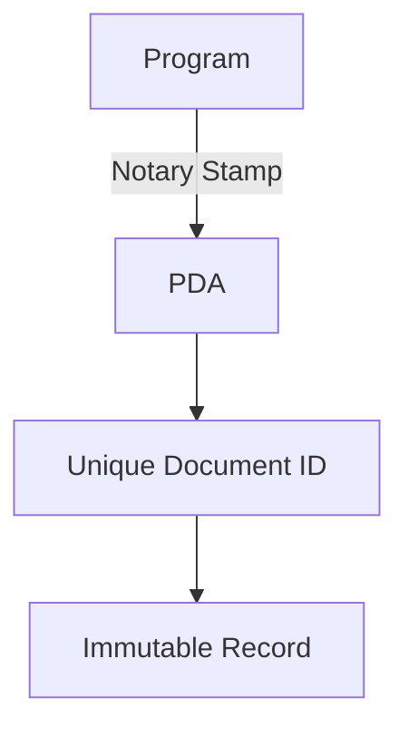
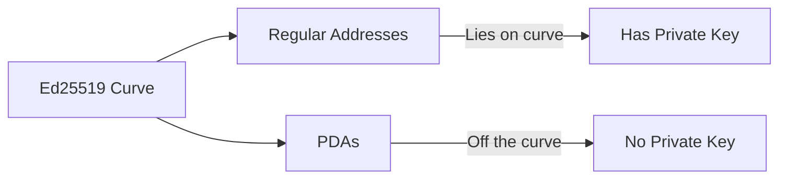

# 03 - Understanding Program Derived Addresses (PDAs)

## 🎯 What is a PDA?

A PDA (Program Derived Address) is a special type of address on Solana that:

- Is derived from seeds and a program ID
- Cannot be owned by a private key
- Is controlled exclusively by the program that created it
- Provides a secure way to create deterministic addresses

## 🧠 Core Mental Models

### 1. The Digital Notary Metaphor



- **Program** = Notary public
- **Seeds** = Document contents being notarized
- **PDA** = Official notary stamp (unique to document+notary)
- **Guarantee**: Only this notary can verify/update the document

### 2. The Keyless Lockbox

Think of a PDA like a digital safe that only your program can open:

- The safe (PDA) has a unique combination (address)
- Only your program knows the combination (seeds + bump)
- No one else can create a safe with the same combination
- The safe can only be opened by following the exact same steps

| Component       | Real-World Analog          | PDA Equivalent               |
|-----------------|----------------------------|------------------------------|
| Lock Mechanism  | Combination lock           | Seed derivation formula      |
| Combination     | 10-20-30                   | Seeds + bump + program_id    |
| Safe Contents   | Valuables                  | Account data                 |
| Unique Feature  | No physical key exists     | No private key possible      |

### 3. Program Memory Slots

Think of PDAs as:

- **Pre-allocated memory slots** only your program can access
- **Deterministic addressing** = predictable memory locations
- **Secure compartments** = isolated data storage

```rust
// Conceptual memory mapping
Program Memory {
    0x123: PDA("user_profile", alice_key),
    0x456: PDA("token_vault", alice_key, mint_key),
    0x789: PDA("global_stats")
}
```

## 🔄 How PDAs are Derived

A PDA is derived using this formula:

```rust
PDA = create_program_address([seeds], program_id)
```

### Key Components

1. **Seeds**
   - Custom data that makes the PDA unique
   - Can be any combination of strings, keys, or numbers
   - Example: `["vault", user.key().as_ref()]`

2. **Program ID**
   - The ID of the program that will control the PDA
   - Example: `3gmuFz3ysgVSCUp1SvMYRyCHFU6iEx2VdpyM4CTPG5Bs`

3. **Bump**
   - A small number (0-255) that ensures the PDA is valid
   - Automatically calculated by Solana
   - Example: `251`

## 🎯 Why Use PDAs?

PDAs are essential for:

1. **Deterministic Addresses**

   ```mermaid
   flowchart TD
       A[Same Seeds + Program ID] --> B[Same PDA Address]
       B --> C[Consistent Across All Nodes]
   ```

2. **Program Control**
   - Only your program can modify PDA data
   - Prevents unauthorized access
   - Ensures data integrity

3. **Unique Identifiers**
   - Creates unique addresses for each user's vault
   - Prevents address collisions
   - Makes it easy to find related accounts

## 🔬 Deep Dive: PDA Mechanics

### Cryptographic Foundations

PDAs leverage Ed25519 elliptic curve properties:



### The Bump Search Algorithm

1. Starts with bump = 255
2. Appends bump to seeds
3. Hashes (sha256) seeds + bump + program_id
4. Checks if result is on curve:
   - If ON curve → try next bump (254, 253...)
   - If OFF curve → valid PDA found

```rust
// How Anchor finds PDAs internally
let bump = ctx.bumps.get("vault_account").unwrap();
let seeds = &[
    b"vault",
    ctx.accounts.user.key().as_ref(),
    &[*bump]
];
let pda = Pubkey::create_program_address(seeds, ctx.program_id)?;
```

### Storage Economics

| Component          | Description                          | Example Values                 |
|--------------------|--------------------------------------|--------------------------------|
| Base Account Size  | Minimum account overhead             | 8 bytes (discriminator)        |
| Your Data          | Vault-specific fields                | 32 bytes (pubkey) + 8 (u64)    |
| Rent Calculation   | `account_size * rent_per_byte`       | 40 bytes × 0.00000348 SOL/byte |

### Advanced PDA Patterns in CommitVault

#### 1. Multi-Signer PDA

```rust
#[account(
    seeds = [b"multisig", &threshold.to_le_bytes(), signers.key.as_ref()],
    bump
)]
pub multisig_pda: Account<'info, Multisig>,
```

#### 2. Time-Locked PDA

```rust
#[account(
    seeds = [b"timelock", user.key().as_ref(), &unlock_time.to_le_bytes()],
    bump,
    constraint = Clock::get()?.unix_timestamp >= unlock_time
)]
pub time_vault: Account<'info, TimeLockedVault>,
```

## 🧪 PDA Verification Checklist

1. Seed Validation:

   ```rust
   require!(seeds[0] == b"vault", InvalidSeeds);
   require!(seeds[1] == user.key().as_ref(), Unauthorized);
   ```

2. Bump Verification:

   ```rust
   let (expected_pda, expected_bump) = 
       Pubkey::find_program_address(seeds, program_id);
   require!(bump == expected_bump, InvalidBump);
   ```

3. Account Ownership:

   ```rust
   require!(vault_account.owner == program_id, InvalidOwner);
   ```

## 🛠️ PDA in Practice: Your VaultAccount

In your CommitVault program, the PDA is derived like this:

```rust
#[account(
    init,
    payer = user,
    space = 8 + std::mem::size_of::<VaultAccount>(),
    seeds = [b"vault", user.key().as_ref()],
    bump
)]
pub vault_account: Account<'info, VaultAccount>,
```

### Breakdown

1. **Seeds**: `[b"vault", user.key().as_ref()]`
   - `b"vault"`: A constant prefix for all vaults
   - `user.key()`: Makes each vault unique per user

2. **Program Control**: `Account<'info, VaultAccount>`
   - Only your program can modify this account
   - The data must match the `VaultAccount` struct

## 🔍 Common PDA Patterns

1. **User-Specific PDAs**

   ```rust
   seeds = ["user", user.key().as_ref()]
   ```

2. **Multi-Resource PDAs**

   ```rust
   seeds = ["token", user.key().as_ref(), mint.key().as_ref()]
   ```

3. **Counter/Sequence PDAs**

   ```rust
   seeds = ["counter", counter.to_le_bytes()]
   ```

## 🚦 Security Considerations

1. **Seed Uniqueness**
   - Use unique combinations of seeds
   - Avoid predictable patterns
   - Include user-specific data when possible

2. **Program Control**
   - Always verify the program ID
   - Use Anchor's account constraints
   - Document your PDA derivation logic

3. **Data Validation**
   - Verify seeds match expectations
   - Check account ownership
   - Validate account data structure

## 📝 Best Practices

1. **Document Your PDAs**
   - Add `/// CHECK:` comments
   - Explain seed choices
   - Document bump usage

2. **Use Clear Naming**
   - Use descriptive seed names
   - Follow consistent patterns
   - Make it easy to understand

3. **Test Thoroughly**
   - Test PDA derivation
   - Verify account access
   - Check edge cases

## 🎯 Next Steps

1. Try deriving a PDA using the Solana CLI
2. Add more PDA accounts to your program
3. Implement PDA-based authorization
4. Write tests for PDA-related functionality

---

## References

- [Solana Docs: PDAs](https://docs.solana.com/developing/programming-model/calling-between-programs#program-derived-addresses)
- [Anchor Docs: Accounts](https://www.anchor-lang.com/docs/accounts)
