# Architecture

## 1. Overview

CommitVault adds a behavioral gating layer to DeFi by requiring users to write a
clear investment plan before accessing locked funds. Users can assign mentors to
review and approve their plan—with comments—ensuring a layer of social and
psychological friction between capital and action. Investment plans are stored
off-chain for flexibility and cost efficiency, while maintaining the security of
on-chain funds.

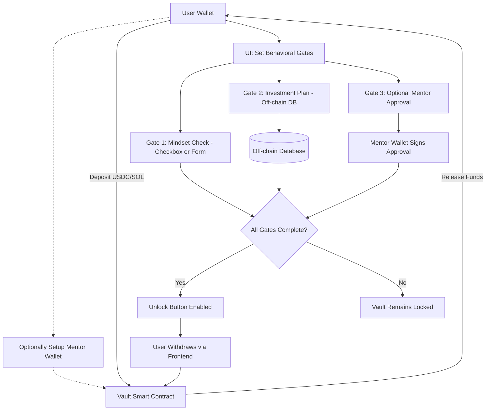

## 2. Account Structure

### PDAs & Token Accounts

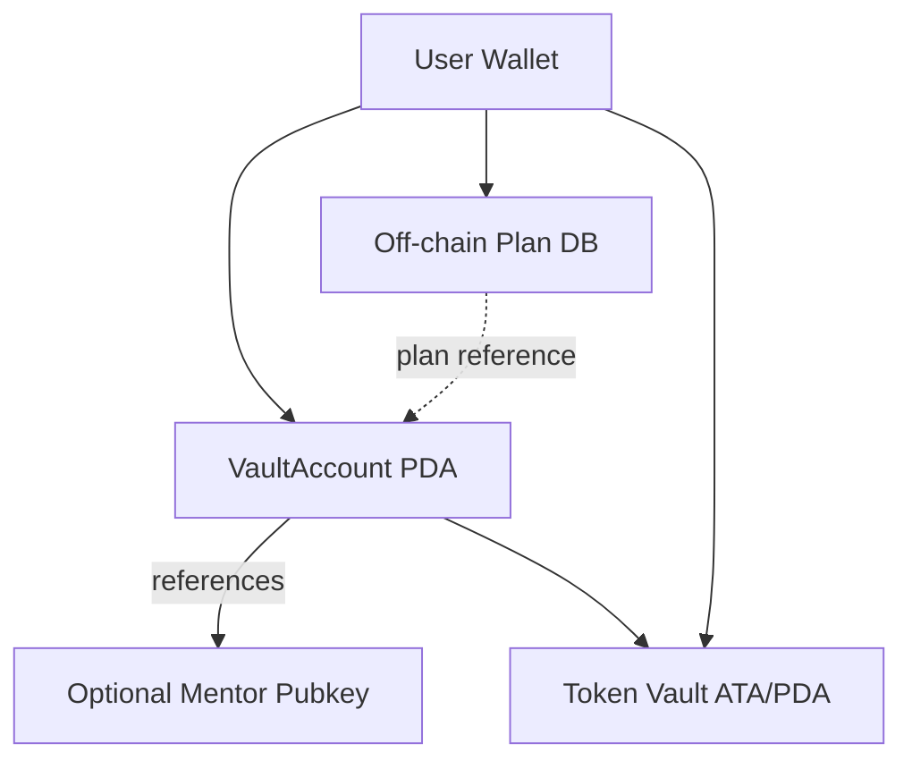

### Account Breakdown

#### VaultAccount (PDA)

- Owner: User
- Status: Locked / Unlocked
- Unlock strategy: Cooldown | MentorApproval
- Token vault reference
- Plan reference hash (for verification)
- Cooldown configuration:
  - Period length (in hours)
  - Start timestamp
  - Completion timestamp
- Mode settings:
  - Current mode: Solo | Mentor
  - Can switch modes: boolean
- Mentor configuration:
  - Current mentor address
  - Submission timestamp
  - Timeout period (default 72 hours)
  - Review status: Pending | Approved | Rejected | Timeout

#### Off-chain Plan Storage

- Plan ID: Unique identifier
- Owner: User wallet address
- Plan sections:
  - Objective:
    - Investment goals
    - Target outcomes
    - Success metrics
  - Risk Model:
    - Risk tolerance level
    - Maximum drawdown
    - Position sizing rules
  - Entry/Exit Strategy:
    - Entry criteria
    - Exit conditions
    - Stop-loss levels
  - Time Horizon:
    - Expected duration
    - Milestone dates
    - Review periods
- Metadata:
  - Creation timestamp
  - Last modified
  - Version number
- Status: Draft/Submitted/Approved/Rejected/Timeout
- Validation status:
  - Required fields completion
  - Section validations
  - Overall completeness
- Mentor feedback:
  - Section-specific comments
  - General feedback
  - Improvement suggestions
- Associated vault address
- Review history:
  - Previous mentor addresses
  - Submission timestamps
  - Review status
  - Mode changes

#### Mentor Account

- Mentor pubkey
- Stored inside VaultAccount if needed
- Used to validate approve_plan

#### Token Vault

- Associated Token Account (ATA) or a PDA holding locked assets
- USDC / SOL (configurable)

### State Transitions

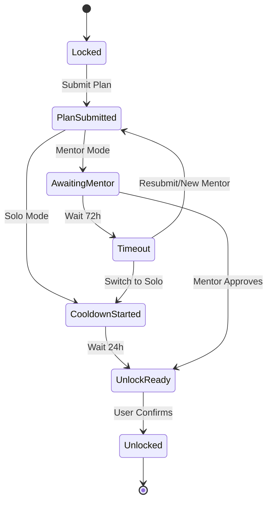

### Mentor Timeout Flow

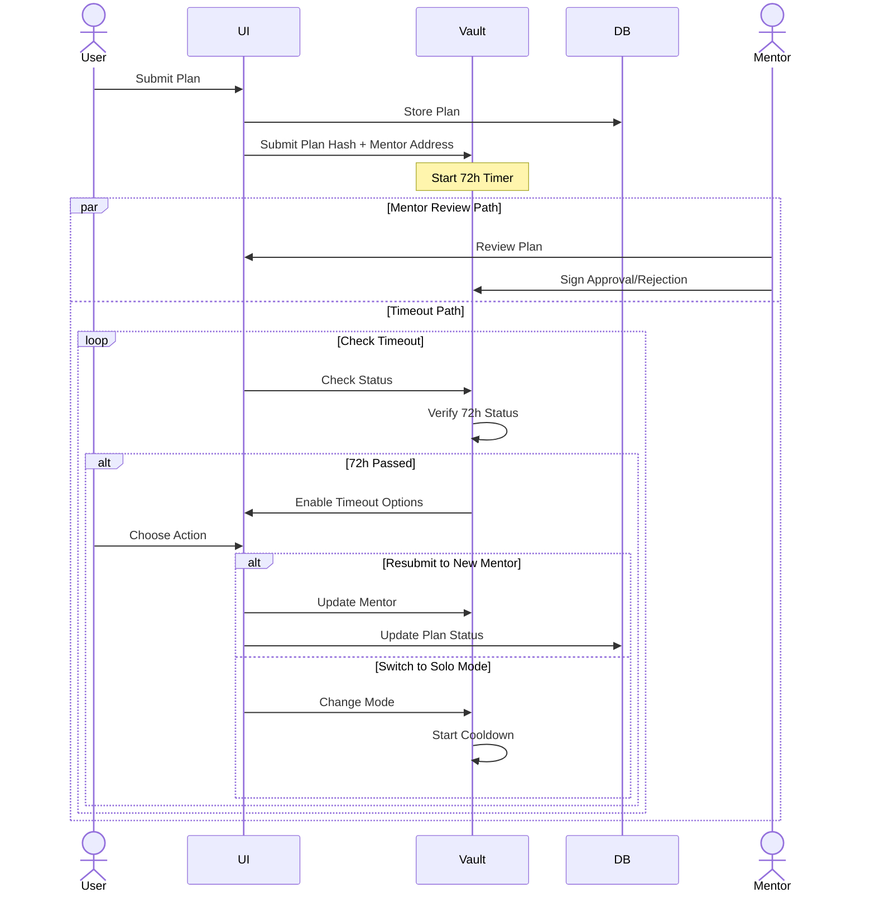

## 3. User Interaction Flow

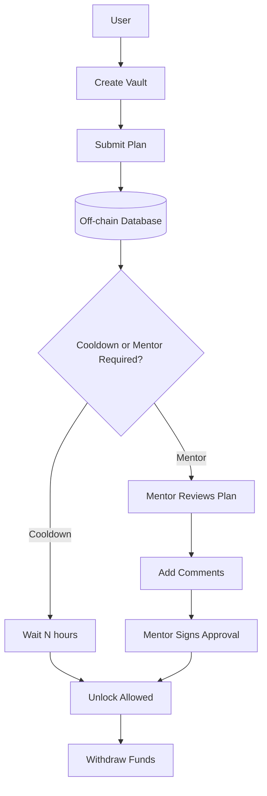

### Flow Details

1. **Create Vault**:

   - Initializes VaultAccount + Token Vault
   - Creates off-chain plan entry
   - Sets mode (Solo/Mentor) and cooldown period
   - If Mentor mode:
     - Sets mentor address
     - Configures timeout period (72 hours)
   - Initializes state as Locked

2. **Submit Plan**:

   - Plan stored in off-chain database
   - Hash of plan stored on-chain for verification
   - Plan status updated to Submitted
   - If Solo mode:
     - Starts cooldown period (24 hours)
     - Records start timestamp
   - If Mentor mode:
     - Records submission timestamp for timeout
     - Transitions to awaiting approval

3. **Mentor Timeout Handling**:

   - System monitors 72-hour timeout window
   - If timeout occurs:
     - Plan status updated to Timeout
     - User can: a. Resubmit to new mentor (resets timeout) b. Switch to Solo
       mode (starts cooldown)
   - All timeout actions recorded in review history
   - Mode changes persist in vault configuration

4. **Withdraw**:
   - Only possible after gate conditions pass
   - Requires valid plan hash verification

## 4. External Dependencies

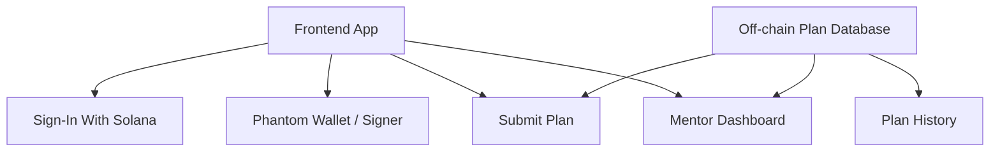

### Component Details

#### Frontend (React + Anchor client)

- Renders vault state and plan form
- Provides structured plan template:
  - Section-by-section input guidance
  - Field validation and completion status
  - Progress tracking
  - Template suggestions and examples
- Manages plan submission to off-chain database
- Displays cooldown timers and mentor status
- Shows plan history and mentor comments
- Handles timeout scenarios:
  - Displays time remaining for mentor review
  - Shows timeout options when applicable
  - Manages mentor reassignment
  - Facilitates mode switching

#### Backend Service

- Stores investment plans and metadata
- Manages plan versions and history
- Handles mentor comments and feedback
- Provides plan verification endpoints
- Template management:
  - Section validation rules
  - Required field definitions
  - Suggestion database
  - Example repository

#### Wallet Integration

- Used to sign transactions and mentor approvals
- Signs plan submissions for authenticity

#### Mentor UI

- Displays pending plans with section breakdown
- Section-specific comment capabilities
- Structured feedback templates
- Plan comparison with historical versions
- Validation override options
- Views plan history and changes

## 5. Plan Submission

### Plan Template Structure

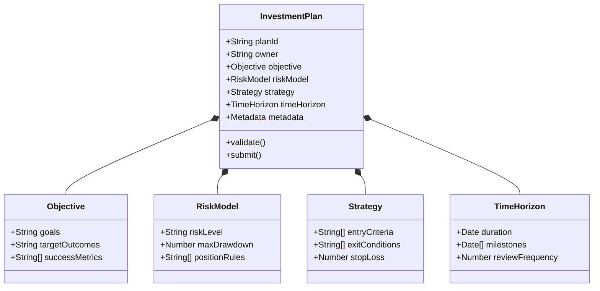

### Plan Submission Flow

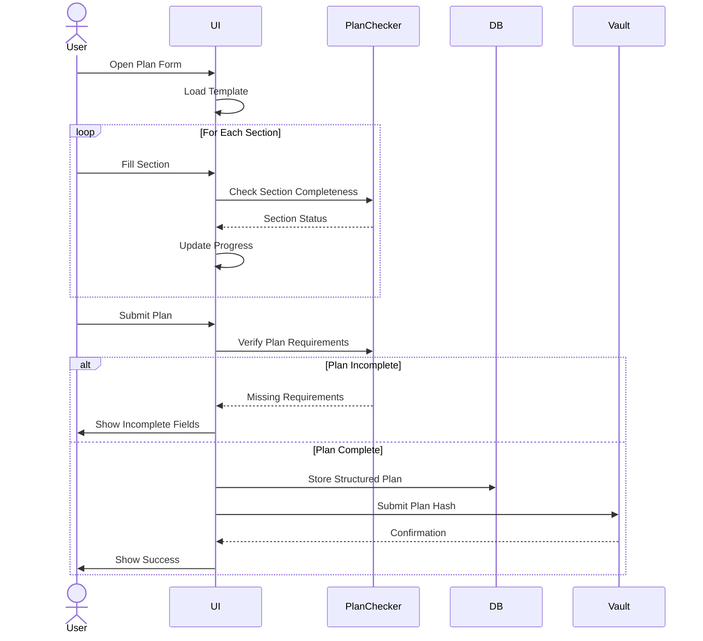

## 6. Mentor Interface

### Mentor Dashboard Structure

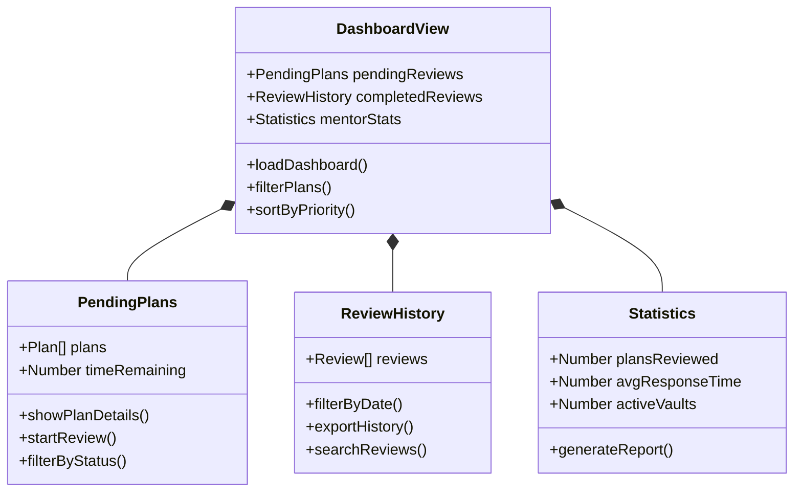

### Mentor Review Workflow

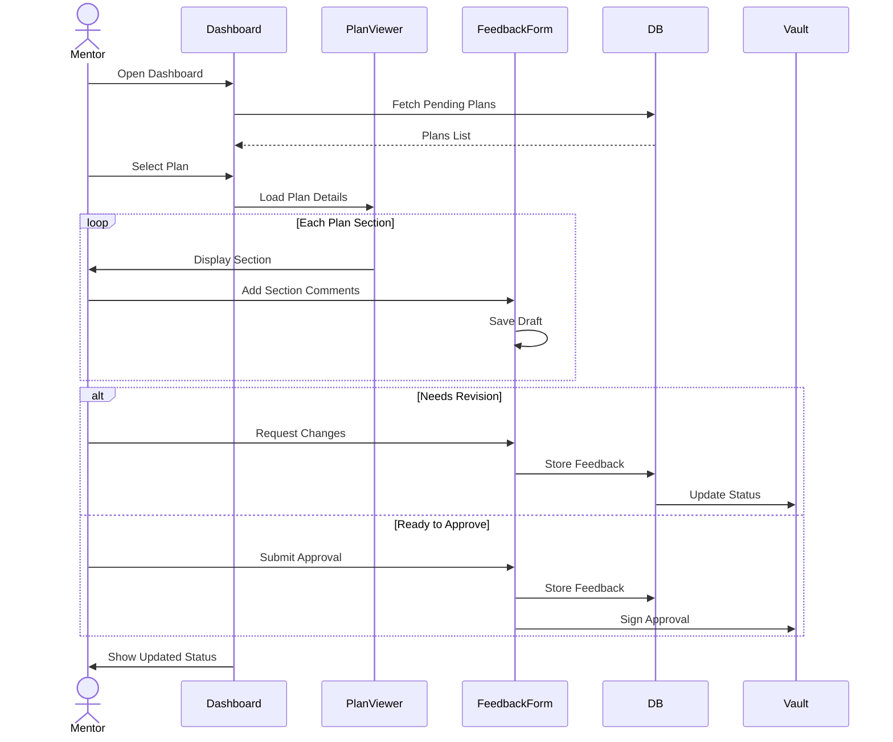

### Dashboard Components

#### Plan Review Queue

- Priority sorting:
  - Time remaining before timeout
  - Plan submission date
  - Vault size
- Status filters:
  - Pending initial review
  - Awaiting revision
  - Ready for approval
- Quick actions:
  - Start review
  - Request changes
  - Approve plan

#### Plan Review Interface

- Side-by-side view:
  - Plan sections
  - Comment/feedback panel
- Section navigation
- Inline commenting
- Template-based feedback
- Historical context:
  - Previous versions
  - Past feedback
  - Revision history

#### Mentor Analytics

- Review statistics:
  - Average response time
  - Plans reviewed
  - Approval rate
- Active vaults overview
- Mentee performance tracking
- Time management tools

#### Communication Tools

- Feedback templates
- Common suggestions library
- Educational resources
- Revision requests
- Approval notifications

### Mentor Review States

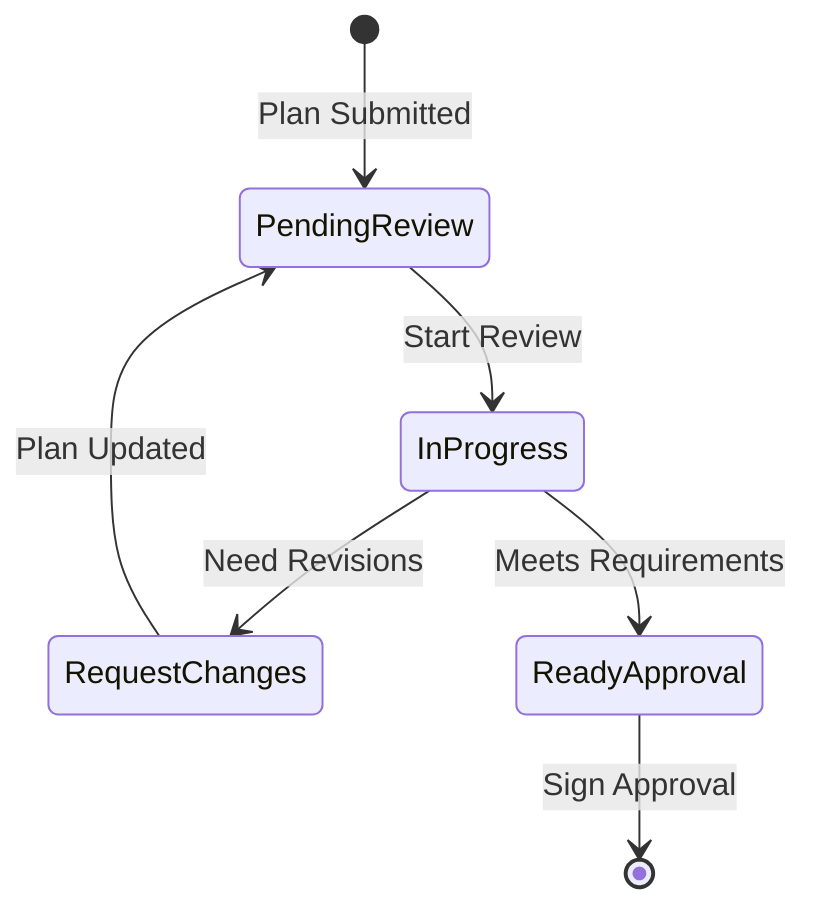

#### Mentor UI

- Comprehensive dashboard view:
  - Plan review queue
  - Active reviews
  - Review history
- Review tools:
  - Section-by-section review interface
  - Structured feedback forms
  - Comment templates
  - Approval workflow
- Analytics and reporting:
  - Review statistics
  - Performance metrics
  - Time tracking
- Communication features:
  - Feedback management
  - Revision requests
  - Approval notifications
