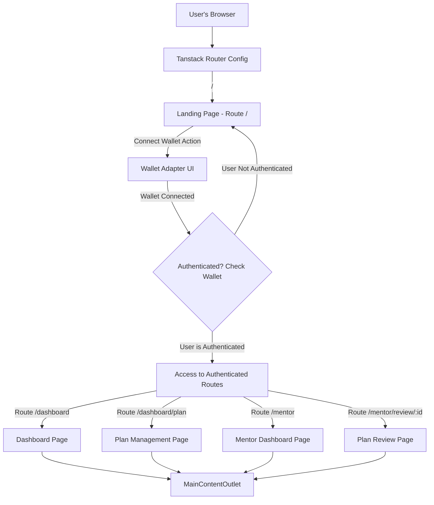
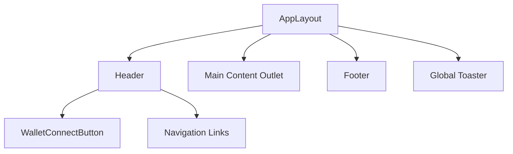
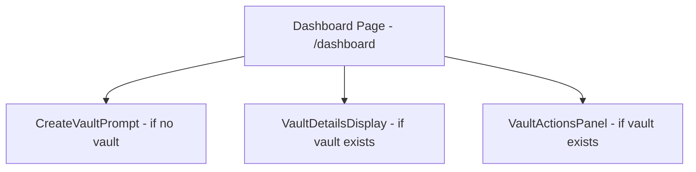
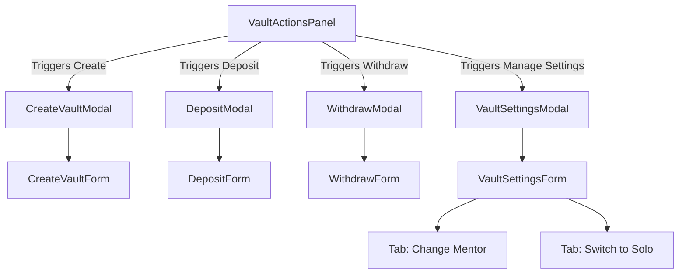
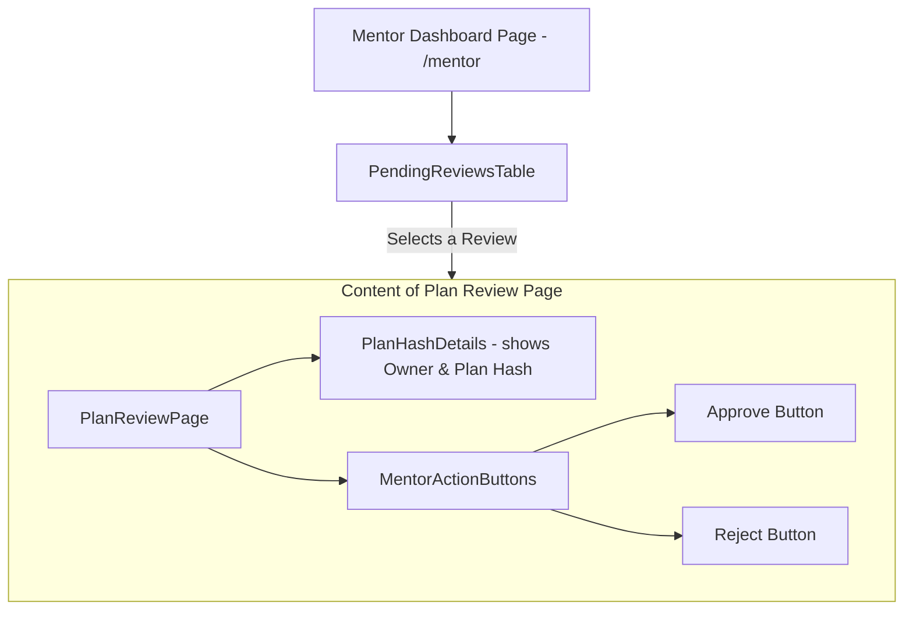
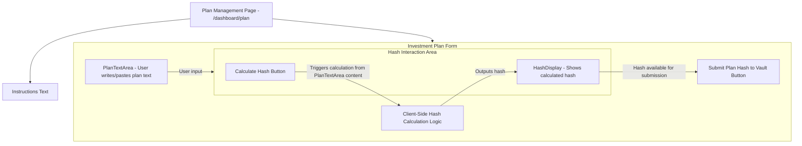

# CommitVault Frontend - Product Requirements Document (PRD)

## 1. Introduction

This document outlines the product requirements for the CommitVault Frontend
application. CommitVault is a Solana-based dApp that introduces a behavioral
gating layer to DeFi, requiring users to commit to an investment plan before
accessing locked funds. This frontend will serve as the primary interface for
users and mentors to interact with the CommitVault smart contract.

**The investment plan itself is a user-authored text document. Its cryptographic
hash (e.g., SHA-256) is what's stored on-chain.** This approach is chosen for
cost-efficiency and practicality. The hash serves as a verifiable commitment to
the specific version of the plan. _(Future considerations may involve using this
hash as an identifier for retrieving the full plan from an off-chain BaaS, but
V1 focuses on the on-chain hash commitment)._

The frontend will be a client-side Single Page Application (SPA) built using
React (with Vite), Tanstack Router for navigation, and will interact directly
with the Solana blockchain. Wallet signatures will serve as the primary
authentication mechanism.

## 2. Goals

- Provide an intuitive and user-friendly interface for users to create and
  manage CommitVaults using shadcn/ui components and Tailwind CSS.
- Enable users to deposit and withdraw SPL tokens securely, gated by their
  chosen unlock strategy.
- Facilitate the creation of a textual investment plan by the user, calculate
  its hash client-side, and submit this hash to their on-chain vault.
- Offer a dedicated interface for mentors to review plan hashes (and associated
  owner addresses) and act upon them.
- Ensure clear communication of vault status, transaction progress, and
  potential errors.
- Maintain a modular, readable, and scalable codebase adhering to defined
  guidelines.

## 3. Target Users

- **Vault Owner (User):** Individuals active in DeFi who wish to implement more
  disciplined trading/investment strategies by committing to a self-authored
  plan.
- **Mentor:** Experienced individuals who can review plan commitments (via hash
  and owner) for Vault Owners.
- **(Public/Unauthenticated User):** Individuals interested in learning about
  CommitVault.

## 4. Project Structure & File Conventions

The frontend application code will reside in the `/app` directory within the
main CommitVault project.

- **File Naming Convention:** All TypeScript/TSX files (components, hooks,
  pages, utilities, etc.) will use **`small-kebab-case`**.
  - Examples: `app-layout.tsx`, `use-commit-vault.ts`, `landing-page.tsx`,
    `solana-utils.ts`.

## 5. Core Technologies

- **Framework/Library:** React (using Vite for build tooling)
- **Routing:** Tanstack Router
- **UI Components:** **shadcn/ui**
- **Styling:** **Tailwind CSS**
- **Wallet Integration:** `@solana/wallet-adapter-react` & relevant wallet
  adapter packages.
- **State Management:** Primarily **React built-in hooks (`useState`,
  `useContext`, `useReducer`)**. **`nuqs`** will be considered for managing URL
  search parameter state if complex query string management becomes necessary.
- **Cryptography (for Hashing):** A standard client-side library for hashing
  (e.g., `crypto-js` or browser's native `SubtleCrypto` API).
- **Data Fetching/Caching (Blockchain):** Tanstack Query.
- **Custom Hooks:** For abstracting complex logic, including Solana interactions
  (see Section 7).

## 6. Key Features & Pages

_(Component and page file paths will follow the `small-kebab-case.tsx`
convention within their respective directories, e.g.,
`app/src/components/layout/app-layout.tsx`)_

### 6.1. Global Components & Layouts

- **`AppLayout` Component:** Main wrapper with `Header`, `Footer`, content area,
  `Toaster`.
- **`Header` Component (`app/src/components/layout/header.tsx`):** Logo,
  navigation (`NavigationMenu`), `WalletConnectButton`.
- **`Footer` Component (`app/src/components/layout/footer.tsx`):** Standard
  footer content.
- **`WalletConnectButton` Component
  (`app/src/components/wallet/wallet-connect-button.tsx`):** shadcn/ui `Button`
  and `DropdownMenu`.
- **`Toaster` Component (from `sonner` via shadcn/ui):** Global notifications.

### 6.2. Public Pages & Components

- **Landing Page (`/`):**
  - **Route:** Tanstack Router.
  - **File:** `app/src/routes/index.tsx` (or `app/src/pages/landing-page.tsx`)
  - **Components (using shadcn/ui):** `HeroSection` (`hero-section.tsx`),
    `FeaturesOverview` (`features-overview.tsx`), `HowItWorks`
    (`how-it-works.tsx`), `FAQSection` (`faq-section.tsx`).

### 6.3. Authenticated User (Vault Owner) Pages & Components

- **User Dashboard / My Vault (`/dashboard`):**
  - **Route:** Protected route.
  - **File:** `app/src/routes/dashboard/index.tsx` (or
    `app/src/pages/dashboard-page.tsx`)
  - **Components (using shadcn/ui):**
    - `CreateVaultPrompt` (`create-vault-prompt.tsx`).
    - `VaultDetailsDisplay` (`vault-details-display.tsx`): Shows balance,
      status, strategy, timers, **current plan hash**.
    - `VaultActionsPanel` (`vault-actions-panel.tsx`): Buttons for modals.
- **Vault Creation Flow (Modal using shadcn/ui `Dialog`):**
  - **Component:** `CreateVaultForm`
    (`app/src/components/vault/create-vault-form.tsx`):
    - `RadioGroup` for `unlockStrategy`. `Input` for cooldown, mentor address,
      timeout. `Button` for submission.
- **Deposit Tokens Flow (Modal using shadcn/ui `Dialog`):**
  - **Component:** `DepositModal`
    (`app/src/components/transactions/deposit-modal.tsx`): `Input` for amount.
- **Withdraw Tokens Flow (Modal using shadcn/ui `Dialog`):**
  - **Component:** `WithdrawModal`
    (`app/src/components/transactions/withdraw-modal.tsx`): `Input` for amount
    (conditionally enabled).
- **Plan Creation & Hash Submission (`/dashboard/plan` or Modal):**
  - **Route/Modal Component:** `InvestmentPlanForm`
    (`app/src/components/plan/investment-plan-form.tsx`)
  - **Components:**
    - `PlanTextArea` (`app/src/components/plan/plan-text-area.tsx`): Large
      `Textarea` for plan input.
    - `CalculateHashButton`
      (`app/src/components/plan/calculate-hash-button.tsx`): Explicit button to
      trigger hash calculation.
    - `HashDisplay` (`app/src/components/plan/hash-display.tsx`): Displays the
      calculated SHA-256 hash.
    - `SubmitPlanHashButton`
      (`app/src/components/plan/submit-plan-hash-button.tsx`): `Button` to
      submit the displayed hash.
- **Vault Settings Management Flow (Modal using shadcn/ui `Dialog`):**
  - **Component:** `VaultSettingsForm`
    (`app/src/components/vault/vault-settings-form.tsx`):
    - `Tabs` for "Change Mentor" / "Switch to Solo Mode". `Input` fields.
      `Button` for submission.

### 6.4. Authenticated Mentor Pages & Components

- **Mentor Dashboard (`/mentor`):**
  - **Route:** Protected route.
  - **File:** `app/src/routes/mentor/index.tsx` (or
    `app/src/pages/mentor-dashboard-page.tsx`)
  - **Components:**
    - `PendingReviewsTable`
      (`app/src/components/mentor/pending-reviews-table.tsx`): `Table`
      displaying Vault Owner, Submission Time, Plan Hash. Links to
      `PlanReviewPage`.
- **Plan Review Page (`/mentor/review/:vaultOwnerAddress`):**
  - **Route:** Protected dynamic route.
  - **File:** `app/src/routes/mentor/review.$vaultOwnerAddress.tsx` (or
    `app/src/pages/plan-review-page.tsx`)
  - **Components:**
    - `PlanHashDetails` (`app/src/components/mentor/plan-hash-details.tsx`):
      Displays Vault Owner address, submitted Plan Hash.
    - `MentorActionButtons`
      (`app/src/components/mentor/mentor-action-buttons.tsx`): `Button` for
      "Approve" / "Reject".

### 6.5. Common Reusable Components

- shadcn/ui base components (`app/src/components/ui/`).
- **Custom Common Components (`app/src/components/common/`):**
  `loading-spinner.tsx`, `error-message.tsx`, `timer-display.tsx`,
  `address-display.tsx`.

## 7. Modularity & Code Style Guidelines

### 7.1. Component Structure & File Guidelines

- **Adhere to shadcn/ui and Tailwind CSS best practices.**
- **React Component Files (`.tsx`):**
  - Typically be around **100-250 lines total**.
  - On VERY RARE occasion can exceed the above and approach **300-400 lines**.
  - Never exceeds **500 lines**
  - Contain a **single main component** (following the single responsibility
    principle).
- **Functions within Components:**
  - Typically be under **30-50 lines**.
  - Rarely exceed **80-100 lines**.
  - Have a **single, clear purpose**.
- **When to Split Components:** Consider splitting when a component:
  1. Becomes difficult to understand at a glance (e.g., 200+ lines).
  2. Has multiple distinct responsibilities.
  3. Contains parts that could be reused elsewhere.
  4. Encapsulates complex logic that can be isolated.

### 7.2. Best Practices for Modularity

1. **Single Responsibility Principle (SRP):**
   - Each file (component, hook, utility) should do one thing and do it well.
2. **Composition over Inheritance:**
   - Break large components into smaller, focused components.
   - Compose them together in parent components.
3. **Separation of Concerns:**
   - UI rendering logic primarily in components.
   - Business logic, complex state manipulations, and side effects in custom
     hooks or utility files.
   - Solana program interactions abstracted via custom hooks.
   - API calls (for future BaaS) in dedicated service files.
4. **Prioritize Readability & Maintainability:**
   - Consistent formatting (enforced by Prettier).
   - Meaningful and consistent naming conventions for variables, functions,
     components, and files.
   - Clear component structure and prop interfaces.
   - Add comments for complex logic or non-obvious decisions.

### 7.3. Custom Hooks (`app/src/hooks/`)

- **Purpose:** Encapsulate reusable stateful logic, side effects, and
  interactions with external systems.
- **Solana Program Interaction Hooks:**
  - **`use-versioned-transaction.ts`:** A hook to abstract the boilerplate of
    preparing, signing (via wallet adapter), sending, and confirming Solana
    versioned transactions. It should handle loading states and errors.
  - **`use-commit-vault.ts`:** This hook will provide well-typed functions for
    interacting with each instruction of the CommitVault smart contract (e.g.,
    `initializeVault`, `depositTokens`, `submitPlanHash`, `mentorApprove`). It
    will internally use `use-versioned-transaction`.
  - **Other Hooks:** Create additional hooks as needed for functionalities that
    can be beneficially abstracted (e.g., `use-client-side-hash.ts` for plan
    hashing logic if it involves state or side effects beyond a simple utility
    function, `use-vault-data.ts` for fetching and memoizing on-chain vault
    account data).
- **Client-Side Hashing Logic:** A utility function likely in
  `app/src/lib/crypto-utils.ts` to encapsulate hash generation from text. If it
  needs to be stateful (e.g., displaying intermediate states), it could be part
  of `use-client-side-hash.ts`.

## 8. Off-Chain Data & BaaS (Deferred)

- **V1 Focus:** All plan creation (text input) and hash generation occurs
  client-side. The text will be stored in local storage. Users are responsible
  for keeping their own copy of the plan text that corresponds to the submitted
  hash.
- **Future State (with BaaS):** Off-chain storage for full plan text and
  retrieval of full plan text for mentor review.

## 9. Non-Functional Requirements

- **Performance:** Optimized for speed.
- **Responsiveness:** Tailwind CSS for adaptive UI.
- **Accessibility (a11y):** Leverage shadcn/ui's accessibility.
- **Error Handling:** Clear feedback via shadcn/ui `Alert` or `Toast`.
- **Code Quality:** ESLint, Prettier, TypeScript.

## 10. Future Considerations (Out of Scope for V1 Frontend - besides BaaS items)

- Structured plan editor instead of plain textarea.
- Client-side validation of plan text format (basic).
- AI-assisted plan template generation.

## 11. Visual Architecture (Mermaid Diagrams)

### 11.1. High-Level Application Flow & Routing Overview

_Description: User journey from browser to specific authenticated pages rendered
within the main application layout._

### 11.2. Global App Shell

_Description: Core layout structure wrapping all views._

### 11.3. Vault Owner Dashboard - Page Structure (`/dashboard`)

_Description: Main components of the User Dashboard page._

### 11.4. Vault Owner Dashboard - Modals Triggered by Actions Panel

_Description: Modals launched from the Dashboard's action panel._

### 11.5. Mentor - Page & Action Structure (`/mentor`)

_Description: Mentor's workflow from dashboard to plan review._

### 11.6. Plan Creation & Hash Submission (`/dashboard/plan`)

_Description: User flow for writing a plan, calculating its hash, and submitting
the hash._
