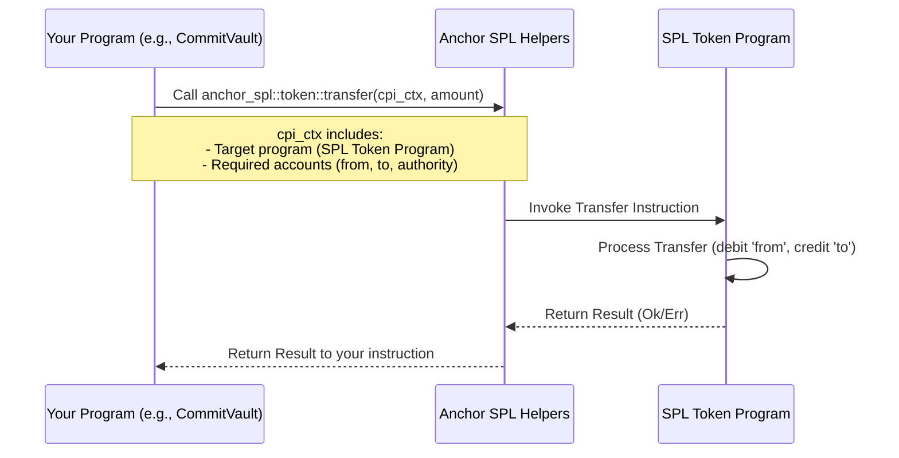

# 04 - Learning: Cross-Program Invocations (CPI) & Token Deposit

## 🎯 Core Concepts

This document covers how to make your Solana program call other programs (CPI),
specifically to handle SPL token deposits into your CommitVault.

---

## 1. Understanding Cross-Program Invocations (CPI)

### 1a. What is CPI and Why is it Needed?

CPI is a mechanism that allows one Solana program to call another. This is
essential for interacting with existing programs, such as the SPL Token Program,
which manages token balances and transfers.

### 1b. How to Perform CPI in Anchor

To perform a CPI in Anchor, you typically follow these steps:

1. Define the `CpiContext` with the necessary accounts.
2. Create the `cpi_accounts` struct for the target instruction.
3. Call the target program's instruction using the `CpiContext`.

- Key components:
  - `CpiContext::new()`
  - Defining the `accounts` struct for the target instruction (e.g.,
    `anchor_spl::token::Transfer`)
  - The `token_program` account.

#### Conceptual CPI Flow Diagram



#### Example CPI Call Structure (Conceptual)

```rust
 let cpi_accounts = anchor_spl::token::Transfer { ... };
 let cpi_program = ctx.accounts.token_program.to_account_info();
 let cpi_ctx = CpiContext::new(cpi_program, cpi_accounts);
 anchor_spl::token::transfer(cpi_ctx, amount)?;
```

---

## 2. Understanding SPL Tokens and Associated Token Accounts (ATAs)

### 2a. SPL Tokens

SPL stands for Solana Program Library, which provides a standard for fungible
and non-fungible tokens. SPL tokens are represented by a "mint" account, which
defines the token type and supply. Each user has a "token account" that holds
their balance of that token.

### 2b. Associated Token Accounts (ATAs)

ATAs simplify the process of managing token accounts by automatically deriving
the address based on the user's public key and the mint's public key. Each user
(or PDA) has a unique associated token account for each token type.

---

## 3. Implementing the `deposit` Instruction

### 3a. Defining `#[derive(Accounts)]` for `deposit`

The `deposit` instruction will require several accounts of type `TokenAccount`
to be passed in.

- Accounts to consider:
  - `user` (`Signer<'info>`, signer, payer for ATA creation if needed)
  - `user_token_account` (source of funds)
  - `vault_account` (PDA, might be needed for ATA seeds or constraints)
  - `vault_token_account` (destination ATA, potentially initialized if it
    doesn't exist)
  - `mint` (to verify token type)
  - `token_program` (for the CPI)
  - `associated_token_program` (if creating an ATA)
  - `system_program` (if creating an ATA)

#### Example `Deposit` Accounts Struct (Conceptual)

```rust
 #[derive(Accounts)]
 pub struct Deposit<'info> {
     // ... user, user_token_account
     #[account(
         init_if_needed, // If the vault's ATA doesn't exist, create it
         payer = user,
         associated_token::mint = mint,
         associated_token::authority = vault_account, // Vault PDA is the authority for its ATA
     )]
     pub vault_token_account: Account<'info, TokenAccount>,
     // ... vault_account (PDA), mint, token_program, associated_token_program, system_program
 }
```

Note: The `user` account in the `Deposit` struct is defined as `Signer<'info>`,
as it is required to sign the transaction.

### 3b. Implementing the `deposit` function

To implement the `deposit` function, you will:

1. Validate the accounts passed to the instruction.
2. Initialize the `vault_token_account` if it does not exist.
3. Create the `CpiContext` for the `token::transfer` call.
4. Call the `token::transfer` function to move tokens from the
   `user_token_account` to the `vault_token_account`.
